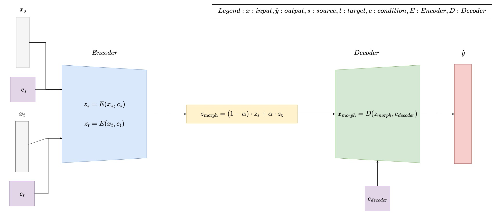

# Conditioned Morpher Transformer model (CMT)

As part of the methodological experiments of the [Freesound Loop Generator](https://github.com/AdaSalvadorAvalos/freesound-loop-generator/tree/main), a custom Transformer model, the Conditioned Morpher Transformer (CMT), was developed to perform audio loop morphing with explicit conditioning on style and tempo. This model extends the capabilities of the pretrained RAVE model by enabling smooth interpolation between audio loops while controlling perceptual attributes.



The CMT architecture is based on a transformer encoder-decoder, augmented with separate FiLM conditioning layers for style and BPM:
- **Encoder**: Encodes audio tokens through multiple codebook embeddings.
- **FiLM Layers**: Independently modulate feature representations according to style and BPM.
- **Interpolation**: Combines source and target representations through linear interpolation to achieve the desired morph.
- **Decoder**: Generates output tokens using cross-attention on the interpolated representation, incorporating the dual conditioning.

This design allows flexible morphing of audio loops, producing outputs that can be smoothly transitioned between source and target while respecting style and tempo parameters.

While the experiment demonstrates that conditioning can influence morphing behavior, limitations in the approach (e.g., BPM conditioning did not function reliably) restricted its use to an exploratory study rather than a core component of the system.


## Installation
Create an environment with the necessary dependencies. Python 3.10, is recommended.
```
pip install -r requirements.txt
```

## Usage
> **Note:** All commands in the Preprocessing, Training, and CLI Inference sections should be run from the `src/` directory.  
> The web interface is launched separately and does **not** require being in `src/`.


### Preprocessing
To preprocess de audio files from a dataset:
```
python preprocess.py --input_dir <INPUT_DIR> --metadata <METADATA_FILE> [options]

```

Required arguments:
- `--input_dir` <INPUT_DIR>: Directory containing WAV files.
- `--metadata` <METADATA_FILE>: Path to metadata.json file.

Optional Arguments:
- `--output_dir` <OUTPUT_DIR>: Directory for processed files (default: DAC_output).
- `--num_files` <N>: Number of files to process (default: all).
- `--preserve_bpm`: Preserve original BPM instead of normalizing.
- `--min_bpm` <FLOAT>: Minimum BPM for filtering (default: 120).
- `--max_bpm` <FLOAT>: Maximum BPM for filtering (default: 130).
- `--filter_by_bpm`: Filter files by BPM range.
- `--shuffle`: Randomly shuffle files before processing.
- `--seed` <INT>: Random seed for shuffling (default: 42)

#### Examples
Using the [Freesound Loop Dataset](https://zenodo.org/records/3967852):
```
python preprocess.py --input_dir FSL10K/audio/wav --output_dir output_preprocess --metadata FSL10K/metadata.json --num_files 2010 --preserve_bpm --shuffle
```

Filter files by BPM between 125–130:
```
python process.py FSL10K/audio/wav --metadata FSL10K/metadata.json --filter_by_bpm --min_bpm 125 --max_bpm 130
```

### Training the model
To train the model run:
```
python train.py
```

Inside the script, you can modify the configuration parameters to suit your needs.

1. **Directory Setup.** The script automatically sets up directories for embeddings, style probabilities, and checkpoints:

```
embeddings_dir = "../output_preprocess_mix_DAC7000/encoded"
prob_dir = "../output_preprocess_mix_DAC7000/style_probs"
save_dir = "trial"  # Directory where checkpoints are saved
os.makedirs(save_dir, exist_ok=True)
```
- `embeddings_dir`: Path to preprocessed audio embeddings.
- `prob_dir`: Path to style probability data.
- `save_dir`: Directory to save model checkpoints.

2. **Model Parameters.** These parameters define the architecture of the Transformer-style model used for encoding and morphing audio.
```
model_params = {
    'num_codebooks': 9,
    'codebook_size': 1024,
    'd_model': 64,
    'nhead': 8,
    'num_encoder_layers': 6,
    'num_decoder_layers': 6,
    'dim_feedforward': 512,
    'dropout': 0.2,
    'style_dim': 400,
    'max_seq_len': 3879
}
```

3. **Training Parameters.**
Training is configured for stability and memory efficiency:
```
train_params = {
    'batch_size': 4,
    'learning_rate': 1e-4,
    'num_epochs': 300,
    'accumulation_steps': 8  # Effective batch size of 32
}
```
- `batch_size`: Number of samples per GPU step.
- `learning_rate`: Optimizer learning rate.
- `num_epochs`: Total number of training epochs.
- `accumulation_steps`: Gradients are accumulated for effective larger batch size without exceeding memory limits.


### Inference
Generate morphed audio between a source and a target WAV file using a trained model by running:
````
python inference.py --checkpoint <CHECKPOINT> --source_file <SOURCE_WAV> --target_file <TARGET_WAV> --output_dir <OUTPUT_DIR> [options]
````
Required Arguments
- `--checkpoint` <CHECKPOINT>: Path to the trained model checkpoint.
- `--source_file` <SOURCE_WAV>: Path to the source audio file (WAV).
- `--target_file` <TARGET_WAV>: Path to the target audio file (WAV).
- `--output_dir` <OUTPUT_DIR>: Directory where the output DAC file will be saved.

Optional Arguments
- `--morph_ratio` <FLOAT>: Morph ratio between 0.0 (source) and 1.0 (target).
- `--target_style` <STYLE_LABELS>: One or more target genre/style labels.
- `--target_style_file` <WAV_FILE>: Path to a WAV file to use for target style reference.
- `--target_bpm` <FLOAT>: Optional target BPM for the output.
- `--gradient_mode`: Generate a sequence of intermediate morphs instead of a single output.
- `--num_steps` <INT>: Number of intermediate steps to generate in gradient mode (default: 10).
- `--cpu`: Force the model to run on CPU even if GPU is available.

#### Examples
Generate a single morphed file with 50% morph ratio:
````
python inference.py \
    --checkpoint pretrained_model.pth \
    --source_file audio/source.wav  \
    --target_file audio/target.wav \
    --output_dir inference/ \
    --morph_ratio 0.5 
````
Generate a sequence of morphs using gradient mode:
````
python inference.py \
    --checkpoint pretrained_model.pth \
    --source_file audio/source.wav  \
    --target_file audio/target.wav \
    --output_dir inference/ \
    --gradient_mode \
    --num_steps 9
````
Morph to match a target style from a WAV file using CPU:
````
python inference.py --checkpoint checkpoints/pretrained_model.pth --source_file audio/source.wav --target_file audio/target.wav --output_dir output --target_style_file audio/target_style.wav --cpu
````

### Evaluation

The `evaluation/` folder contains notebooks and scripts for **objective evaluation** of generated audio.  
- Compares outputs from the pretrained **Conditioned Morpher Transformer (CMT)** to outputs generated by a pretrained **RAVE model**.  
- Notebooks include full explanations of preprocessing, FAD computation, and visualization of results.  
- To run the evaluation, open the notebooks and follow the instructions within each cell.

### Web Interface

You can also interact with the Conditioned Morpher Transformer using a web interface—perfect for playful experimentation and listening to morphs before downloading them.  

#### How to Launch

1. Run the web server:

```bash
python web_app/app.py
```
2. Once running, open the `web_app/main.html` file in your favorite browser.

This will give you an interactive interface to load source and target audio, adjust morph ratios, and play results immediately.
